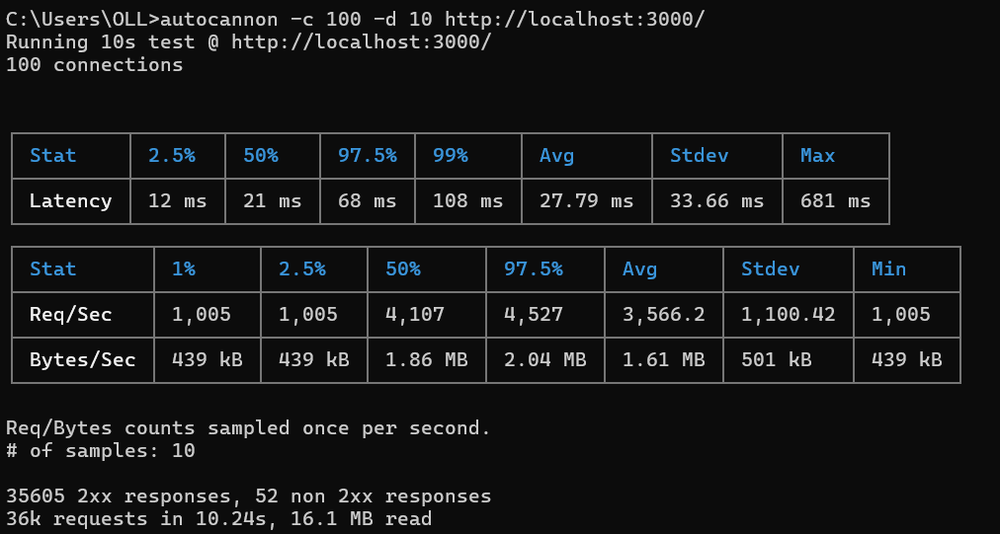
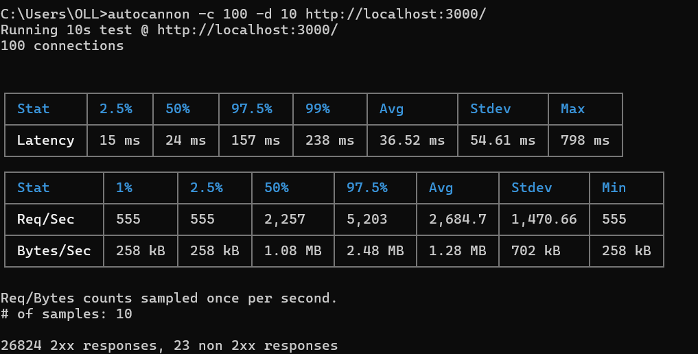

# Caching Proxy

A high-performance, command-line caching proxy server built with Node.js. It proxies incoming HTTP and HTTPS requests to a designated origin server, enforces hybrid Time-To-Live (TTL) and Least Recently Used (LRU) memory constraints, and exposes real-time telemetry and stats.

---

## Evolution & Feature Roadmap

The project evolved through three distinct version releases:

### Version 1.0 (Core Proxy & TTL Caching)
- **Protocol-Agnostic Proxying:** Transparently forwards incoming request headers, methods (GET, POST, PUT, DELETE, etc.), and request bodies using Node.js streams.
- **Automatic Transport Selection:** Detects and routes to origin servers over HTTP or HTTPS automatically.
- **In-Memory Caching Layer:** Uses a JavaScript `Map` to cache complete responses keyed by request URL.
- **Time-To-Live (TTL):** Hardcoded 60-second expiry window with lazy expiration checked during cache lookups.
- **CLI Configuration:** Supports `--port`, `--origin`, and `--clear-cache` configuration flags with strict input validation.

### Version 1.1 (Observability & Telemetry)
- **High-Resolution Latency Tracking:** Measures exact request processing time using `perf_hooks` and injects an `X-Response-Time` telemetry header into every client response.
- **Real-Time Metrics Engine:** Tracks cumulative server statistics including `totalRequests`, `cacheHits`, and `cacheMisses`.
- **Internal Stats Endpoint (`/--stats`):** Exposes a dedicated health check and performance monitoring endpoint returning uptime, active cache size, and dynamic hit-ratio percentages in JSON format.
- **3-State Console Logging:** Provides instant visibility into proxy behavior with `[HIT]`, `[MISS]`, and `[EXPIRED]` console logs.

*Baseline Performance Benchmark (100 concurrent connections):*


### Version 1.2 (Bounded Memory & LRU Eviction Policy)
- **Bounded Memory Architecture:** Implements a strict capacity limit of **1,000 items** on the cache `Map` to protect the Node.js runtime against Out-of-Memory (OOM) crashes under high concurrency.
- **Hybrid LRU + TTL Eviction:** Automatically evicts the oldest (least recently used) key when the cache hits capacity before inserting new items.
- **Recency Touch Logic:** Updates cache hit recency order on every successful read to ensure active items are preserved.
- **Space-Time Trade-Off Awareness:** Balances minor CPU mutation overhead on cache hits against absolute system stability and memory safety under heavy load.

*Post-LRU Benchmark (Showing memory safety vs. CPU mutation trade-off):*


---

## Prerequisites

- Node.js (v18+ recommended) installed on your machine.

---

## Installation

### Local Usage

Clone the repository and run it locally:

```bash
git clone <your-repository-url>
cd caching-proxy
npm install
